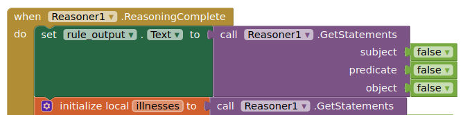

# Diagnosing Health Conditions via Local Decision Support

## Overview

In this exploration topic, you will build apps that leverage online (medical) linked data and implement clinical decision logic to aid in diagnosing health conditions, and help patients with self-manging their health. Please note that the app we are building **is not a substitute for a diagnosis from a medial professional and should not be used as such**.

So-called "patient diaries" are useful for recording your medications, symptoms, or general notes on your health. But, they can also *act on this health data* to help pateints to better (self-)manage their health condition. In this tutorial, we show how you can *implement your own clinical decision logic*, with arbitrary complexity, running locally on the user's device, to analyze the user's health data and informing them of any conclusions.

Sleep apnea affects at least 1 in 20 adults, and its diagnosis is often done in an expensive sleep study that needs to be performed in a hospital setting. In this tutorial, we will build an app that (a) accepts user-entered health data, and (b) implements a subset of the Canadian Huidelines for Sleep Apnea, to alert the user of a potential sleep apnea diagnosis.

## Creating the Linked Data Form

In a nutshell, we will add user-provided health information into an RDF graph, and then run a set of rules over this RDF graph to infer whether or not the user (likely) has sleep apnea.

Hence, the first step is adding a *LinkedDataForm* to our screen. Please see the RdfNotepad tutorial for how to do this step-by-step.

You will also need to add a *LinkedData* component to store your data, but we will also use the new *Reasoner* component to apply rules over the data. Add both the *LinkedData* and *Reasoner* components to your screen, and set the `Model` property of the `Reasoner1` instance to the `LinkedData1` component. Make sure to click the **OK** button to confirm your selection.


Next, we will add a set of input fields to the *LinkedDataForm* that ask relevant health data from the user: whether they've experienced excessive daytime sleepiness; choking or gasping during sleep; and/or recurrent awakenings from sleep. Also, we're interested in how many sleep apnea events occurred during the night.

Let's add a series of checkboxes (or switches) for the yes/no questions, a textbox (restrited to numeric input) for the last question, and finally, a button for submitting the information:


For the textbox, check the `NumbersOnly` to ensure it will only allow numeric input and in the `ObjectType` property enter `xsd:int` so that Punya knows to model the value as an integer.

Note that for the latter question, we add a `HorizontalArrangement` component (see the `Layout` category) and included a `Label` component in front of the `TextBox` to describe its purpose to the app user.

Make sure that all of the inputs (checkboxes, textboxes) are descendants of the `LinkedDataForm1` component.

For each of these input fields, we'll set corresponding *PropertyURI* properties so their values will be properly loaded into our *LinkedDataForm*. For einstance, when selecting the "excessive daytime sleepiness" checkbox in the UI pane, enter the following: *hasExcessiveDaytimeSleepiness*


(full URI: *http://projects.cs.dal.ca/niche/sleepapnea.owl#hasExcessiveDaytimeSleepiness*)

Use the auto-complete to discover the other property URIs as well:

*http://projects.cs.dal.ca/niche/sleepapnea.owl#hasChokingOrGaspingDuringSleep*<br>
*http://projects.cs.dal.ca/niche/sleepapnea.owl#hasRecurrentAwakeningsFromSleep*<br>
*http://projects.cs.dal.ca/niche/sleepapnea.owl#hasNrOfSleepApneaEventsDuringSleep*

Feel free to try out the UI using the Companion App

# Connect the Companion

<howto id="connect_app"></howto>

# Implementing the Clinical Decision Logic

## Creating Rules

Next, let's computerize the sleep apnea guidelines. The following is an informal representation of (a subset of) the Canadian Guidelines for Sleep Apnea:

```
IF ExcessiveDaytimeSleepiness THEN patient meets DiagnosticA
IF ChokingOrGaspingDuringSleep THEN patient meets DiagnosticB1
IF RecurrentAwakeningsFromSleep THEN patient meets DiagnosticB2
IF NumberOfApneaSleepEvents >= 5 THEN patient meets DiagnosticC
IF patient meets DiagnosticA and DiagnosticC THEN patient may have sleep apnea
IF patient meets two distinct instances of DiagnosticTypeB and DiagnosticC THEN patient may have sleep apnea
```

To implement these rules, we'll create a ruleset using blocks from the `Logic`{:.logic} category. Let's start by defining some namespaces. This will allow us to use more concise qualified names in our rules:


(Map ex: to *http://projects.cs.dal.ca/niche/sleepapnea.owl#*)<br>
(Map dc: to *http://purl.org/dc/terms/*)

Now we need to create the rules for each of the guideline criteria above. You can use s/p/o statement blocks, containing qualified names and variables, to add clasues to the rule.


These rules will reason over the RDF data from our *LinkedDataForm*. Hence, you'll have to make sure that these rules reference the same *PropertyURI* values you specified on the input fields (e.g., *ex:hasExcessiveDaytimeSleepiness*). To make life a bit easier, there is a qualified-name block with an auto-populated dropdown for properties and classes from the selected namespace:


(These are loaded automatically from a SPARQL endpoint based on the namespace URI. Currently, this endpoint is set up for the "dc" and "ex" (sleep apnea) namespaces for the purposes of this tutorial.)

You can create similar rules for each of the other yes/no questions; or feel free to stick to a more manageable subset of these rules (e.g., two rules inferring DiagnosticA and DiagnosticC, respectively; and the rule inferring sleep apnea based on those diagnostics).

<note>
In a block's (right-click) context menu, you can select "duplicate" to copy the block - this is often more convenient than having to re-construct the block.
</note>

Next, add the following rule for the criterion on the number of sleep apnea events:


You'll also need to create rules that infer a potential sleep apnea diagnosis, e.g., for the last criteron:


After, we'll add all those rules to a single ruleset, which we pass as input to our `Reasoner1` instance when the app is initialized, via the `Reasoner1.RulesFromRuleset`{:.method} method:


<note>
Double-clicking on any block will reduce its size to a single line - this will come in handy when constructing queries or rulesets.
</note>

At this point, we have all the core components - a *LinkedDataForm*, which keeps an RDF graph with user-provided health data; and a *Reasoner*, loaded with a ruleset for diagnosing potential sleep apnea. Now, let's tie these components together!

## Putting it all together

Add an event handler for the "check" button, which (1) loads the *LinkedDataForm* RDF graph into the *LinkedData* instance (after clearing it first), and (2) runs the *Reasoner* over this *LinkedData* instance. Remember, we already linked the reasoner to the linked data instance.


Just to be sure, let's add an error event handler to the reasoner as well (in case we made a mistake in the rules!)


(For this purpose, add a Label to your screeen called rule_output.)

Next, we'll add an event handler that listens for when the *Reasoner* execution is complete. At that point, we will ask the *Reasoner* for any inferences (we're interested in *hasIllness* conclusions), and assign those to a local variable (see "variable" blocks category):


The *GetStatements* method accepts wildcards in the form of `false`{:.boolean} blocks, i.e., the method block retrieves all statements with an *ex:hasIllness* predicate.

Of course, we'll want to show the user what our clinical decision support has come up with. We can do this in multiple ways. Here, we'll add a Label to the screen:


(initially, set its text to "waiting for some decision support!")

Finally, we'll set the value of this label based on whether the reasoner inferred sleep apnea or not. We can use the following sentences:

* According to the Canadian Guidelines for Sleep Apnea, your symptoms indicate obstructive sleep apnea.
* According to the Canadian Guidelines for Sleep Apnea, your symptoms do not indicate obstructive sleep apnea.

If the reasoner has not inferred any *ex:hasIllness* statements, we want to show the second sentence; else, the first sentence. We can use an if/then/else block from the Control category for this:


At this point, try out your sleep apnea patient diary using the Companion app!

If you're not getting the expected results, you can print all inferred statements to the *rule_output* label (you'll have to add it to the UI, if you haven't already):


