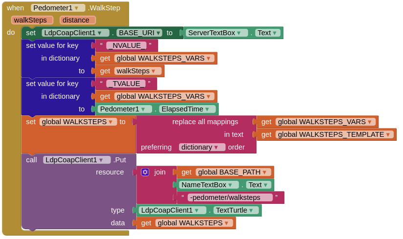
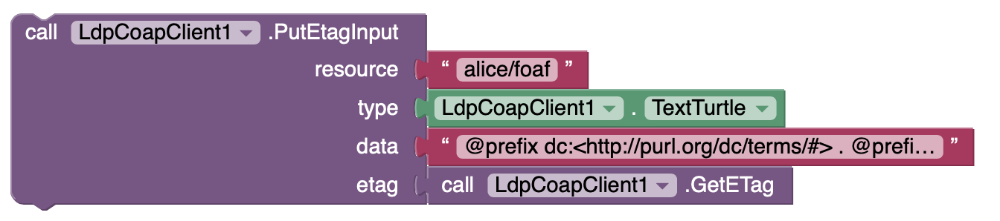

# Overview

## Introduction

The goal of this tutorial is to learn how to build your first mobile app exploiting the [LDP-CoAP](http://swot.sisinflab.poliba.it/ldp-coap/){:target="_blank"} guidelines.

We will look at an example of mobile phone sensor sharing app, using the **LDP-CoAP Client** component for Punya. 

The app we are going to build will work as a client of an external CoAP server: you will be able to publish sensors and sensor data as resources with their app, as well as to discover resources published by other tutorial users.

## Mobile device sensor sharing app

Our app will have four main capabilities:
* register a mobile phone/tablet sensor as an RDF resource on an LDP-CoAP server; as an example, we will take the embedded `pedometer` sensor;
* annotate sensor data as soon as they arrive and publish them on the server;
* discover sensors registered on the server;
* get data for a selected sensor.

# Build a sensor sharing app

## Add Punya components

We start the new Punya project and we drag-and-drop two non-visible components in the empty app screen: first, the `Pedometer` component from the **Sensor** list in the palette.

{:.enlargeImage}

We can leave default values for its two properties: `StopDetectionTimeout` (an idleness timeout) and `StrideLength` (in meters, to calculate the distance covered with counted steps).

The second non-visible component is the `LdpCoapClient` from the **Connectivity** list in the palette. We will not use its properties in this example app.

{:.enlargeImage}

## Set the Server URL

Now, some user interface. Let’s start with a `VerticalArrangement` (from the **Layout** list in the palette) for the main flow of UI components: we will set Fill parent for both _Height_ and _Width_ properties. 

Now add an `HorizontalArrangement` within it, with Automatic _Height_ and Fill parent _Width_. 

We firstly need a text field to allow the user to set the URL of the LDP-CoAP server: inside the HorizontalArrangement add a Label (from the **User Interface** list in the palette) and set "Server URL:" for the Text property on the Properties panel. 

Now add a TextBox next to the Label and set both its Hint and Text to `coap://punya-sparql.csail.mit.edu:5683`, which resolves to `coap://37.183.195.98:5683` at the time of writing this tutorial. 

Notice that the CoAP protocol has `coap://` URI scheme and default UDP port `5683`. You can set its _Width_ to Fill parent for better looks. 

{:.enlargeImage}

It may be useful to give this TextBox a recognizable name, e.g. _ServerTextBox_, by selecting it in the Components hierarchy to the right of the UI screen and clicking Rename.

{:.enlargeImage}

## Set the user name

Now we need another `HorizontalArrangement` row with a Label and a TextBox: this is for allowing users to insert their name. 

We can call this TextBox _UserTextBox_.

{:.enlargeImage}

## Add a button to register new sensors

Now we need a Button labeled _Register sensor_ with Width set to Fill parent. We can rename it _RegisterButton_ to be more meaningful.

Sensor discovery will occur automatically through server polling. 

For this we need a `Clock` non-visible component (from the **Sensors** list in the palette): it is important to un-check the `TimerEnabled` property; we will enable it through blocks at the right moment. 

The `TimerInterval` property holds the time (in milliseconds) before the timer expires and an event is fired: we may set a reasonable polling period between `5000` and `10000` ms.

{:.enlargeImage}

## Add the sensor list

Now we need a `ListView` component called _SensorListView_ to show all discovered sensors: let’s set its Width to Fill parent and Height to **30 percent** or **35 percent** (that should be good for the majority of screen sizes and resolutions).

Finally, we add a `TextBox` called _OutputTextBox_ for sensor data, with both Width and Height set to Fill parent to fill the rest of the screen. 

This is the end result:

{:.enlargeImage}

# Define the application logic

## Model the pedometer as RDF resource

Now let’s work on the logic of our app. Firstly, we want it to be able to register a `Pedometer` (implemented by Punya using the mobile device embedded sensors) as a RDF resource on our LDP-CoAP server. 

The RDF description follows this basic template in **Turtle** syntax:

```
@prefix ldp:<http://www.w3.org/ns/ldp#> .
@prefix dc:<http://purl.org/dc/terms/#> .
@prefix m3:<http://sensormeasurement.appspot.com/m3#> .

<> a ldp:BasicContainer, m3:Pedometer ;
	dc:title "_NAME_ pedometer" .
```

We use three Linked Data vocabularies here:
* `ldp`: the [Linked Data Platform vocabulary](https://www.w3.org/ns/ldp){:target="_blank"} , a very small vocabulary for specifying the resource and container types according to LDP;
* `dc`: the popular [Dublin Core Metadata Initiative (DCMI) terminology](https://www.dublincore.org/specifications/dublin-core/dcmi-terms/){:target="_blank"}  for the resource attribution domain;
* `m3`: the [Machine-to-Machine Measurements (M3) ontology](http://sensormeasurement.appspot.com/?p=m3){:target="_blank"}  for the Internet of Things (IoT) domain, containing a large number of classes and properties related to devices, sensors, and measurements.

The RDF document contains just 3 triples:
* the first one says that the resource we are registering is a LDP BasicContainer, the most basic type of resource which is capable of “containing” other resources in the LDP resource hierarchy on the server;
* the second one says the resource is also an instance of the `m3:Pedometer` class which represents pedometers in the M3 ontology;
* the last one provides a resource title, for convenience.

<note>
When publishing a RDF resource with the LDP-CoAP server, you must use <> to refer to it in the body of the request; you will specify the desired resource path in the resource field of the request. 
</note>

## Using variables

Moreover, in the RDF document `_NAME_` is a variable which will be replaced with the user name to personalize the resource. 

So this snippet works as a template for us: let’s declare two global variables, a string with the Turtle text and a dictionary with the variable names we will use to replace their respective values. 

We also declare a global variable for the substitution result, initialized to an empty string.

{:.enlargeImage}

We also need to define the base resource path for the LDP-CoAP that will be registered. The LDP-CoAP server set up for the tutorial has a pre-loaded BasicContainer at path sensors, therefore:

{:.enlargeImage}

## Register a resource

We can use the RegisterButton for registering our resource, and also for starting the `Clock` and the `Pedometer`, which will then generate their own app events from that moment on. In detail we will:
1. Respond to the `RegisterButton`{:.event} click event (from the RegisterButton block menu);
2. Start the Pedometer with the appropriate function;
3. Start the Clock by setting `TimerEnabled`{:.setter} to true;
4. Set the `BASE_URI` property of the `LdpCoapClient` to the server URI taken from the `ServerTextBox` field;
5. Replace the `_NAME_` anchor in the `PEDOMETER_BC_TEMPLATE`{:.variable} with the user name taken from `UserTextBox` and assign the result to `PEDOMETER_BC`; notice that using a Punya dictionary to store placeholder-value pairs simplifies the substitutions in the Turtle template, as just one replace all mappings block (from the Text element in the block palette) is needed;
6. Finally, do the `PUT`{:.method} request with the `LdpCoapClient` to upload the resource, specifying its path, MIME type (`text/turtle`) and data (the body, stored in the `PEDOMETER_BC` variable). 

This ends the app actions in response to the `RegisterButton` Click event. 

{:.enlargeImage}

## Model collected events

Since we have started the Pedometer component in step 2, it will fire events whenever a step is counted. 

We can intercept the events to push the updated step count to the LDP-CoAP server. 

The step count will be another RDF resource in Turtle syntax, following this template:

```
@prefix xsd:<http://www.w3.org/2001/XMLSchema#> . 
@prefix m3:<http://sensormeasurement.appspot.com/m3#> .

<> a m3:NumberStep ;
    m3:hasValue "_NVALUE_"^^xsd:nonNegativeInteger ;
    m3:hasDateTimeValue "_TVALUE_"^^xsd:nonNegativeInteger .
```

This time we need just the M3 ontology to say that: 
* the resource is an instance of the `m3:NumberStep` class it provides to denote the step count from a `m3:Pedometer`; 
* the `m3:hasValue` property links the resource to the non-negative numeric value for step count; 
* similarly, the `m3:hasDateTimeValue` property links the resource to a time reference for the measurement.

<note>
The property name hasDateTimeValue appears to refer to a precise moment in time, but actually M3 just specifies that it is a time reference. In several Semantic Web of Things projects in the wild it is used to refer to a time span, so we can legitimately use it to specify the time elapsed since pedometer activation.
</note>

Like before, we declare three global variables for the template above, the Turtle string we will publish on the server, and a dictionary holding the placeholders we will be replacing (like binding variables); in this case we have `_NVALUE_` and `_TVALUE_` for the step count and elapsed time, respectively.

{:.enlargeImage}

## Register the WalkStep event

Now we are ready to respond to the _WalkStep_ event fired by the Pedometer. 

Notice it carries two values: `walkSteps` (the step count) and `distance` (the overall distance covered; we will not use this value, but extending the app to do so is straightforward). In detail we have to:
1. Set the `BASE_URI` property of the `LdpCoapClient` to the server URI taken from the `ServerTextBox` field;
2. Set the values of `_NVALUE_` and `_TVALUE_` in the substitution dictionary to the walkSteps value passed by the WalkStep event and the `ElapsedTime` property of the Pedometer, respectively;
3. Replace the values in the template in order to get the final form of the RDF resource;
4. Use the `Put` block of LdpCoapClient to publish data, specifying the resource path, content/format type and data payload. 

{:.enlargeImage}

<note>
Step 1: it is a good practice to set the BASE_URI property every time a new LDP-CoAP request is prepared, because the server endpoint may have changed in the meantime (in the case of this app, the user can change it).
</note>

<note>
Step 4: using the PUT CoAP method, every time a resource with the same path is uploaded, it replaces the previous representation of the resource. In this app our goal is to keep just the most up-to-date step count on the server, not all the individual events. In other IoT/SWoT applications we may be interested in storing all the events: that could be done, e.g., by means of a LDP Container containing a resource with a unique path for each event.
</note>

## Discover LDP-CoAP resources

When handling the `RegisterButton` Click event, we also enabled the `Clock` timer to periodically discover sensors registered on the server. 

The _CoRE Link Format_ specification for resource discovery in CoAP (also compatible with HTTP) defines the response is a comma-separated list of resource records: each resource record is a semicolon-separated list of resource attributes; the first attribute in each record is always the resource path on the server.

```
res1attrib1 ; res1attrib2 ; … res1attribN1, res2attrib1 ; res2attrib2 ; … res2attribN2 , … , resMattrib1 ; resMattrib2 ; … resMattribN
```

If no resource is registered on the server, the payload will be empty. Our goal is to populate SensorListView with the paths of discovered resources for step counts, therefore we will use three more variables:
* `recordList`: a list to store retrieved resource records;
* `pathList`: a list to store the paths of step count resources;
* `responseText`: a string to store the discovery response from the server.

{:.enlargeImage}

Step by step, we have to:
1. Intercept the `Timer` event of the Clock component;
2. Perform a CoAP-based resource discovery according to the specification and store its response payload;
3. Check that the response text is not an empty string;
4. Split the response into a list of resource records (using the `Split Text` block with “,” separator;
5. For each resource record, split it into a list of resource attributes and take the first one, that is, the resource path;
6. If the path contains the “walksteps” segment, we take it; however, in Link Format the resource path is written as `</path/to/resource>`, which means that for LDP-CoAP requests we must discard the first two characters and the last character;
7. Now we have to add the path to the path list, but we have to check it is not already there (this closes the iteration on the resource records;
8. Populate `SensorListView` with the paths; if the discovery response was empty, we will put just a _“-No sensor found-”_ string to inform the user.
9. Before closing this handler for the Clock Timer event, we have to enable the Clock Timer again, because otherwise it disables after firing once.

{:.enlargeImage}

<note>
Step 5: in Punya, indexes start at 1, not at 0.
</note>

## Retrieve a discovered resource

Now the last piece of logic for our app is reacting to user selection of one resource paths in the ListView. 

We just `GET` the corresponding resource and show it in OutputTextBox. In detail:
1. Respond to the `AfterPicking` event of the `SensorListView` component;
2. Check that the selected item is not the previous _“-No sensor found-”_ string;
3. In that case, perform a `GET` request with the path in the selected `ListView` item and `text/turtle` MIME type;
4. Append the response to the `OutputTextBox` component.

{:.enlargeImage}

## Congratulations!

You've made your first Android app with MIT Punya using LDP-CoAP!

This app provides just a basic example of using LDP-CoAP in Punya for Linked-Data-enabled IoT scenarios. 

We could do many further interesting things with the retrieved resources, exploiting the other components explored in the earlier parts of the tutorial and the many more which are available.

# LDP-CoAP Client component usage reference 

## Introduction

Use the LDP-CoAP Client component to enable mobile apps to discover, publish and get resources on an LDP-CoAP Server. 

To use the LDP-CoAP Client, the first step is to take it from the Connectivity section of the MIT App Inventor Palette and drop it to the `Viewer`. 

{:.enlargeImage}

## Blocks Editor

Then go to the `Blocks Editor`. 

The working principle of this component is based on two phases: 
1. make a request to an LDP-CoAP server; 
2. handle the server response. 

Before starting the creation of requests, it is mandatory to set the `BASE_URI`{:.setter} parameter, which indicates the LDP-CoAP server URL. 

Considering `LdpCoapClient1` as component name, the following block needs to be placed in the Blocks Viewer: 

{:.enlargeImage}

The placed block requires a string input value which indicates the server URL that requires the following format: `coap://ipaddress:port`.

For example, if the server URI value is `coap://192.168.1.128:5683` the following configuration is needed: 

{:.enlargeImage}

Available requests are: 
1. `GET` request 
2. `POST` request 
3. `PUT` request 
4. `DELETE` request 
5. `PATCH` request 
6. `HEAD` request 
7. `OPTIONS` request 
8. LDP `Resource Discovery` request 

## GET request

To perform a `GET` request the following `Get`{:.method} block is needed: 

{:.enlargeImage}

This block requires 2 arguments: 
* `resource`: a string which indicates the resource path;
* `type`: an integer which indicates the requested MIME type for the resource. 

For example, this block performs a GET request on `alice` with a `text/turtle` response content format: 

{:.enlargeImage}

## POST request

To perform a `POST` request the following `Post`{:.method} block is needed:

{:.enlargeImage}

This block requires 4 arguments: 
* `resource`: a string which contains the resource creation path;
* `type`: an integer which indicates the resource MIME type;
* `data`: a string that contains resource data;
* `title`: a string which contains the resource name. 

If more LDP-CoAP parameters are needed, such as rt, they can be placed by appending `&parameter_name=value` to the title field or by appending `?parameter_name=value` to the resource field. 

For example, this block creates a `text/turtle` RDF Resource called `photos` in the `alice` path: 

{:.enlargeImage}

Because the `photo` resource is an LDP Basic Container, the additional CoAP parameter `rt` is needed with value `ldp:BasicContainer`. 
 	 
The following block is equivalent to the previous one; in this case, the `rt` parameter is appended to the resource field. 

{:.enlargeImage}

## PUT request

To perform a `PUT` request the following `PutEtagInput`{:.method} block is needed:

{:.enlargeImage}

This block requires 4 arguments: 
* `resource`: a string which contains the resource creation path;
* `type`: an integer which indicates the resource MIME type;
* `data`: a string that contains resource data;
* `etag`: a string which contains the Resource ETag value. 

Another block called `Put`{:.method} is also available, which does not require the `ETag` option. 
 	 
The following block performs a PUT request for the `foaf` resource in the `alice` Container by considering an `ETag` value obtained from the latest GET request: 

{:.enlargeImage}

Conversely, the following block performs the PUT request omitting the `ETag` option: 

{:.enlargeImage}

## DELETE request

To perform a `DELETE` request, the following `Delete`{:.method} block is needed: 

{:.enlargeImage}

This block requires only one argument: 
* `resource`: a string which contains the resource path. 

For example, the following block deletes the `foaf` resource in the `alice` Ccontainer: 

{:.enlargeImage}

## PATCH request

To perform a `PATCH` request the following `PatchEtagInput`{:.method} block is needed:

{:.enlargeImage}

This block requires 4 arguments: 
* `resource`: a string which contains the resource creation path;
* `type`: an integer which indicates the resource MIME type;
* `data`: a string that contains resource data;
* `etag`: a string which contains the Resource ETag value. 

Another block called `Patch`{:.method} is also available, imitting the `ETag` request option. 
 	 
For example, the following block performs a `PATCH` request with ETag on the `alice` resource: 

{:.enlargeImage}

Conversely, the following block performs the PUT request omitting the `ETag` option: 

{:.enlargeImage}

## HEAD request

To perform a `HEAD` request, the following `Head`{:.method} block is needed: 

{:.enlargeImage}

This block requires only one argument: 
* `resource`: a string which contains the resource path. 

For example, the following block performs a HEAD request on the `alice` Container resource: 

{:.enlargeImage}

## OPTIONS request

To perform an `OPTIONS` request, the following `Options`{:.method} block is needed: 

{:.enlargeImage}

This block requires only one argument: 
* `resource`: a string which contains the resource path. 

For example, the following block performs an OPTIONS request on the `alice` resource: 

{:.enlargeImage}

## CoRE Link Format resource discovery

To perform resource discovery according to the [CoRE Link Format specification](https://tools.ietf.org/html/rfc6690){:target="_blank"}, several blocks are available, depending on the MIME type of the response content.

To perform a discovery that returns a `text/turtle` response content format, the following `DiscoveryResourcesTextTurtle`{:.method} block is available:

{:.enlargeImage}

To perform a discovery that returns a `text/plain` response content format, the following `DiscoveryResourcesTextPlain`{:.method} block is available: 

{:.enlargeImage}

To perform a discovery that returns an `rdf/patch` response content format, the following `DiscoveryResourcesRdfPatch`{:.method} block is available: 

{:.enlargeImage}

## Response handling

After the execution of a request, the response can be handled by using the following blocks: 

* `GetETag`{:.method}: returns the `ETag` value, if available. 

{:.enlargeImage}

* `getContentFormat`{:.method}: returns the `MIME content format` code, if available. 

{:.enlargeImage}

* `getResponseText`{:.method}: returns the `response text`, if available. 

{:.enlargeImage}

* `getRequestStatus`{:.method}: returns the request `CoAP status`. 

{:.enlargeImage}

* `getLocationPath`{:.method}: returns the created resource `Location-Path`, if available. 

{:.enlargeImage}

* `getResponseCode`{:.method}: returns the `Response Code`, if available. 

{:.enlargeImage}
