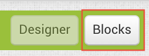

# Overview

## Introduction

The goal of this tutorial is to learn how to build your first mobile app using semantic web and linked data technologies.

Today we will be using a tool called Punya. It brings semantic web features to a web-based development environment based on the [MIT App Inventor](https://appinventor.mit.edu){:target="_blank"} project.

Punya provides a drag-and-drop web interface to design your mobile apps, a blocks-based language to program the app, a companion app to live test your app without compiling, and a build server to package your app for distribution.

To complete this tutorial, you will need to have a valid Google account.

We will be using the live testing feature for this tutorial.

## Environment Setup

If you have an Android device, you can install the companion app for live testing from [this link](http://punya.appinventor.mit.edu/companions/MITPunyaCompanion.apk){:target="_blank"}.

If you don't have an Android device, you can set up Android Studio and use the Android emulator. Please see [this document](https://docs.google.com/document/d/1wN5QUk9gVnnmSj6d7lkUeWoMeaMwruUdZD4DXv0rM8c/edit?usp=sharing){:target="_blank"} for setup instructions for the emulator.

In the next section, we will explore the Punya Development Environment.

# Punya Development Environment

## An Overview of the Editor

Punya projects are composed of one or more `Screen`s. By convention, the first Screen in a project is called `Screen1`. Each `Screen` has two editors, the *Designer* and the *Blocks* editor.

## The Designer

{:.enlargeImage}

The Designer is a WYSIWYG-like (what you see is what you get) editor that you use to lay out the app design. It is broken down into a series of panels, which from left to right are the Palette, the Viewer, the Components, the Media, and the Properties.

The **Palette** provides a list of all of the components available in the system for building your app, grouped by category. For thist utorial, we'll mainly be looking at the User Interface, Layout, and Linked Data components.

The **Viewer** is where you lay out the contents of your app. You can drag and drop components from the Palette into the Viewer to add them to your project.

The **Components** panel shows a tree-based view of the structure of your screen. This can be useful for selecting and manipulating items in the project.

The **Media** panel is used to add app content, such as text files, images, audio, etc. to your project.

The **Properties** panel shows the properties of the currently selected component. as we work thorugh this tutorial, we will need to adjust various properties of the components we use to build up the app.

## The Blocks Editor

{:.enlargeImage}

The Blocks Editor is where you program your app. It provides a visual programming language built on the Google Blockly library.

The **Blocks** panel shows the category of all of the blocks. There are built-in blocks that provide the basic programming language of Punya.

The **Media** panel is the same as that shown in the Designer.

The **Viewer** panel shows the blocks workspace. Initialliy it is blank, but we will build up the functionality of our app in this area as you work through the tutorial.

Let's proceed to build our first app, the RDF Notepad.

# Build RDF Notepad

## Add LinkedDataForm

Click on the Linked Data header in the palette to expand the Linked Data section.

{:.center}

<note>
There is a search bar above the palette that allows you to quickly look up components by name rather than having to go through the categories.
</note>

Drag the LinkedDataForm item from the palette and drop it in the viewer area.

{:.enlargeImage}

In the Properties panel, click on the box under Width that says "Automatic...", specify Fill Parent in the popup that appears, and thenk click OK to resize the LinkedDataForm.

{:.center}

## Add TextBoxes for Input

Under the User Interface palette category, drag out two TextBox components and drop them into the LinkedDataForm one after the other. Set the following properties:

TextBox1:

* Width = Fill Parent
* Hint = Title
* ObjectType = xsd:string
* PropertyURI = dc:title

TextBox2:

* Height = 50%
* Width = Fill Parent
* Hint = Description
* ObjectType = xsd:string
* PropertyURI = dc:description

<note>
To make the code more readable, you can rename a component by selecting it and then click "Rename" in the Components panel.
</note>

## Complete the User Interface

Drag a Button component (User Interface) to the LinkedDataForm, which we will use to submit the data, and a LinkeData component (Linked Data) where we will store our RDF graph. Set the Button's Text property to "Save Note".

Once you have finished the above, your app design should look like this:

## Code the App

In the top right of the editor window there are two buttons, Design and Blocks. So far, we have been working in the Design portion of the editor. Click on Blocks to switch to the Blocks editor.

{:.center}

Punya has three main categories of blocks: "Built-In" blocks, Component blocks, and Generic (Any Component) blocks.

{:.center}

Built-in blocks define many of the operations on datatypes that one would find in a typical programming language, such as booleans, numbers, strings, lists, and dictionaries. Punya builds on App Inventor's language by including blocks for SPARQL and the Jena Rules language.

Component blocks represent properties, methods, and events of component instances. Fo rexample, many of the properites configured earlier in this tutorial can also be changed progammatically in the blocks. Methods and events provide a way of interacting more deeply with the system and respond to change in the envinronment, such as to respond to user interaction.

Generic blocks represent properties, methods, and event blocks as a function of the component type rather than a particular instance. This allows you to apply them to many instances, for example, to write a for loop over a list of components.

<note>
Punya has a feature called Typeblocking that allows you to use the keyboard to create blocks by name, coding by text similar to a standard IDE.
</note>

## Define a Namespace

For our first app, we will want to store our notes in the LinkedData1 component when we click on our Save button. First, let's declare the Dublin Core namespace (http://purl.org/dc/terms/) by using the define namespace and URI blocks from the logic drawer:

## Handling an Event

Punya uses an event-driven model (e.g., an event occurs when the user clisk a button). We can act on these events with a component block. Expand the tree under `Screen1` by clicking the + sign to the elft of `Screen1`; click `Button1` from the list and locate the `when Button1.Click` block from the list. It will look like the image below. Drag the block into the workspace.

To start, let's save our notes to a Turtle file. First, we need to convert the LinkedDataForm into an RDF graph. To convert the content of our user interface into an RDF graph, we use the `AddDataFromLinkedDataForm`{:.method} method of the `LinkedData` component. This method takes a single parameter, i.e., *form*, that is a reference to the component that serves as the root UI element to traverse and convert into RDF. To provide the *form*, select the `LinkedDataForm1` component in the tree, scroll to thej bottom of the block list, and drag in the `LinkedDataForm1`{:.component} block into the workspace. After converting our form into RDF, we will need to use the method `WriteDataToLocal`{:.method} to save it to disk. Typically, we'd want to handle whether the write operation is successful or not, but for the purposes of this tutorial we will ignore the result and assume it always succeeds.

Proceed to the next section to get started with live testing your app.

# Start Live Testing

<howto id="connect_app"></howto>

# More About Live Testing

You use live testing mode to make changes and observe them in real time. Fill out your form and click on the Save button to try out your app. You can also evaluate expressions and observe the output. For example, under the LinkedData1 component, find the ToString method block:

Drag this block into your workspace, right click on it, and select "Do It" from the menu. You will get a bubble that contains the content of the RDF graph.

This technique can be used for fast, iterative prototyping and testing.

Now let's create a UI to show our list of notes and see how the live testing environment works.

# Create a Note List

## Storing the Note Titles

In the Design view, locate the ListView component in the User Interface palette and drag it into your app below the LinkedDataForm1.

In the Blocks view, we will populate this list with the titles of our notes.

First, create a new `global variable`{:.variable} (found in the Variables built-in blocks) and assign an `empty dictionary`{:.dictionary}:

## Reading the Note Titles

In the `noteTitles`{:.variable} variable we will store a reverse mapping of title to URI. When the title is selected in the list, we will retrieve the corresponding URI and then look up the text of the note. First though, let us populate this dictionary by declaring a new procedure, `updateNoteList`{:.procedure}, to populate it and our note list:

{:.enlargeImage}

Add a call to this procedure at the end of the `when Button1.Click`{:.event} event to populate `ListView1` when the note is saved. The block to call the method can be found in the `Procedures`{:.procedure} category of blocks.

## App Initialization

We will also want to populate the `noteTitles`{:.variable} when the app starts. To do so, click on `Screen1` to open its block list, locate the `when Screen1.Initialize`{:.event} event block, and drag it into the workspace. Use the `ReadDataFromLocal`{:.method} method on the `LinkedData1` component to read in the notes file and then populate the note list.

{:.enlargeImage}

## Populating the LinkedDataForm

Lastly, we need to add behavior to `ListView1` to respond to selections. This is done with the `when ListView1.AfterPicking`{:.event} event. The form's contents can be populated using the `FillFromLinkedData`{:.method} block by providing the `LinkedData1` component containing the RDF graph and the subject URI. We can get the subject URI by looking it up from the `noteTitles`{:.variable} mapping.

{:.enlargeImage}

The `FillFromLinkedData`{:.method} method sets the `LinkedDataForm`'s `Subject`{:.getter} property for editing purposes. However, we lways want our Save Note button to write a new note. To make this so, adjust the logic of the `when Button1.Click`{:.event} event handler by dragging in a `set LinkedDataForm1.Subject`{:.setter} block and an empty text block to reset the subjkect, which forces the creation of a new entity.

{:.enlargeImage}

Try out your changes by live testing. Once you're done testing, let's learn about building (compiling) apps.

# Building

If you want your app to persist, you can compile it into an Android Package (APK) file and install it onto your device. To build the app, open the Build menu and select Save APK to my Computer. After the build completes, the APK file will be located in your Downloads folder.

Congratulations! You've made your first semantically enabled Android app with MIT Punya!
